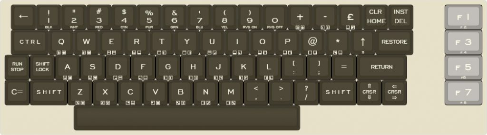
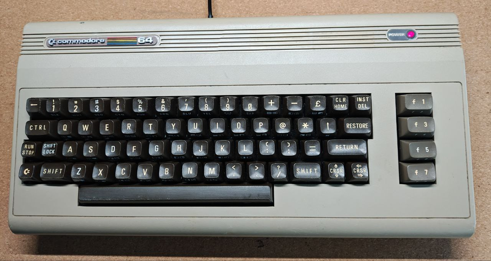
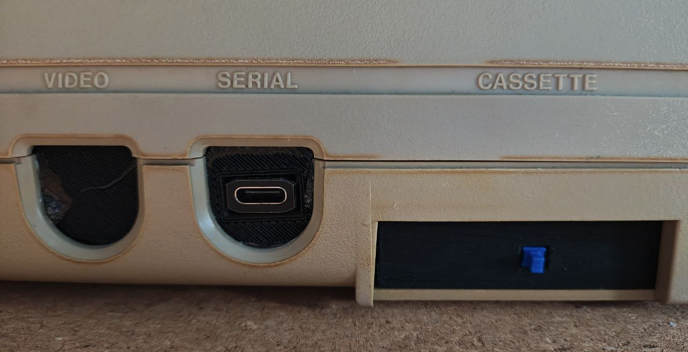
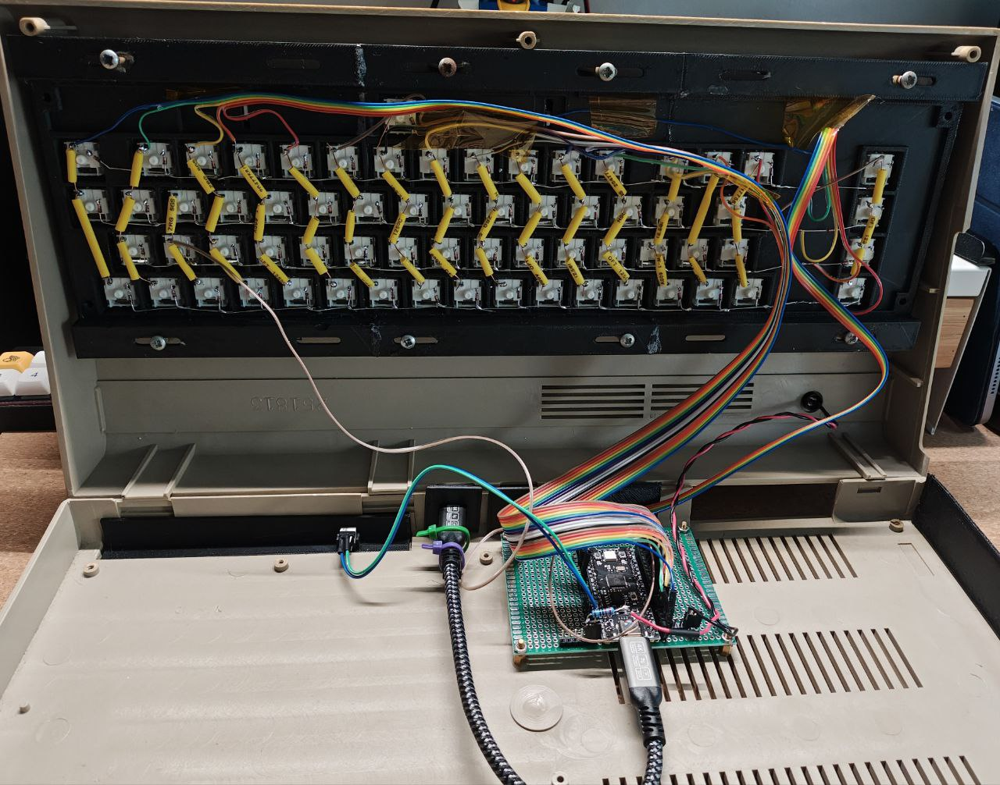

# Commodore C64 (PiK64)

The Commodore 64, also known as the C64, was a popular home computer released in 1982. It had an 8-bit processor and 64 KB of RAM, which was a significant amount of memory at the time. The C64 was known for its versatility and affordability, and it quickly became one of the best-selling computers of all time. It was used for a wide variety of applications, including gaming, programming, and business. The C64's legacy lives on today, with many enthusiasts still using and developing for the platform.

---



## Project PiK64







```bash
[{x:0.25,c:"#413c2c",t:"#f1ecda",p:"SA R1",a:7,f:7},"←",{a:5},"!\n1\n\n\nBLK",{f:9,fa:[0,7,0,0,7]},"\"\n2\n\n\nWHT",{f:5,fa:[0,7,0,0,7]},"#\n3\n\n\nRED","$\n4\n\n\nCYN",{f:7},"%\n5\n\n\nPUR",{f:6,fa:[0,7,0,0,7]},"&\n6\n\n\nGRN",{f:9,fa:[0,7,0,0,7]},"’\n7\n\n\nBLU",{f:7},"(\n8\n\n\nYEL",")\n9\n\n\nRVS ON","\n0\n\n\nRVS OFF",{a:7,f:9},"+\n\n\n\n<i class='petscii petscii-halftone'></i> <i class='petscii petscii-cross'></i>","-\n\n\n\n<i class='petscii petscii-halftone-left'></i> <i class='petscii petscii-bar-vert-4'></i>","£\n\n\n\n<i class='petscii petscii-halftone-bottom'></i> <i class='petscii petscii-diag-bottom-top-filled'></i>",{a:5,f:5},"CLR\nHOME","INST\nDEL",{x:1.25,c:"#e9bf69",a:7,f:9,w:1.5},"f 1\n\n\n\nf 2"],
[{x:0.25,c:"#413c2c",p:"SA R2",f:4,w:1.5},"C T R L",{f:7},"Q\n\n\n\n<i class='petscii petscii-tbar-right'></i> <i class='petscii petscii-circle-filled'></i>","W\n\n\n\n<i class='petscii petscii-tbar-left'></i> <i class='petscii petscii-circle-open'></i>","E\n\n\n\n<i class='petscii petscii-tbar-up'></i> <i class='petscii petscii-bar-horz-1'></i>","R\n\n\n\n<i class='petscii petscii-tbar-down'></i> <i class='petscii petscii-bar-horz-6'></i>","T\n\n\n\n<i class='petscii petscii-bar-horz-0'></i> <i class='petscii petscii-bar-vert-1'></i>","Y\n\n\n\n<i class='petscii petscii-block-horz-1'></i> <i class='petscii petscii-bar-vert-6'></i>","U\n\n\n\n<i class='petscii petscii-block-horz-2'></i> <i class='petscii petscii-corner-round-bottom-right'></i>","I\n\n\n\n<i class='petscii petscii-block-horz-3'></i> <i class='petscii petscii-corner-round-bottom-left'></i>","O\n\n\n\n<i class='petscii petscii-block-horz-4'></i> <i class='petscii petscii-bar-top-left'></i>","P\n\n\n\n<i class='petscii petscii-block-horz-5'></i> <i class='petscii petscii-bar-top-right'></i>","@\n\n\n\n<i class='petscii petscii-bar-horz-7'></i> <i class='petscii petscii-bar-bottom-right'></i>",{f:9},"*\n\n\n\n<i class='petscii petscii-diag-top-bottom-filled'></i> <i class='petscii petscii-bar-horz-4'></i>",{f:7},"↑\n\n\n\nπ",{f:4,w:1.5},"RESTORE",{x:1.25,c:"#e9bf69",f:9,w:1.5},"f 3\n\n\n\nf 4"],
[{c:"#413c2c",p:"SA R4",f:3},"RUN STOP","SHIFT LOCK",{f:7},"A\n\n\n\n<i class='petscii petscii-corner-square-bottom-right'></i> <i class='petscii petscii-spade'></i>","S\n\n\n\n<i class='petscii petscii-corner-square-bottom-left'></i> <i class='petscii petscii-heart'></i>","D\n\n\n\n<i class='petscii petscii-corner-square-bottom-right-filled'></i> <i class='petscii petscii-bar-horz-2'></i>","F\n\n\n\n<i class='petscii petscii-corner-square-bottom-left-filled'></i> <i class='petscii petscii-bar-horz-5'></i>","G\n\n\n\n<i class='petscii petscii-bar-vert-0'></i> <i class='petscii petscii-bar-vert-2'></i>","H\n\n\n\n<i class='petscii petscii-block-vert-1'></i> <i class='petscii petscii-bar-vert-5'></i>","J\n\n\n\n<i class='petscii petscii-block-vert-2'></i> <i class='petscii petscii-corner-round-top-right'></i>","K\n\n\n\n<i class='petscii petscii-block-vert-3'></i> <i class='petscii petscii-corner-round-top-left'></i>","L\n\n\n\n<i class='petscii petscii-block-vert-4'></i> <i class='petscii petscii-bar-bottom-left'></i>",{a:5,f:6},"[\n:","]\n;",{a:7,f:7},"=",{f:4,w:2},"RETURN",{x:1.5,c:"#e9bf69",f:9,w:1.5},"f 5\n\n\n\nf6"],
[{c:"#413c2c",p:"SA R5",f:7},"C=",{f:4,w:1.5},"S H I F T",{f:7},"Z\n\n\n\n<i class='petscii petscii-corner-square-top-right'></i> <i class='petscii petscii-diamond'></i>","X\n\n\n\n<i class='petscii petscii-corner-square-top-left'></i> <i class='petscii petscii-club'></i>","C\n\n\n\n<i class='petscii petscii-corner-square-top-right-filled'></i> <i class='petscii petscii-bar-horz-3'></i>","V\n\n\n\n<i class='petscii petscii-corner-square-top-left-filled'></i> <i class='petscii petscii-cross-diag'></i>","B\n\n\n\n<i class='petscii petscii-checkerboard'></i> <i class='petscii petscii-bar-vert-3'></i>","N\n\n\n\n<i class='petscii petscii-block-vert-5'></i> <i class='petscii petscii-diag-bottom-top'></i>","M\n\n\n\n<i class='petscii petscii-bar-vert-7'></i> <i class='petscii petscii-diag-top-bottom'></i>",{a:5,f:6},"<\n,",">\n.","?\n/",{a:7,f:4,w:1.5},"S H I F T",{a:5,f:3},"&#x021d1;\n&#x021d3;\n\n\n\n\nCRSR","&#x021d0;\n&#x021d2;\n\n\n\n\nCRSR",{x:1.5,c:"#e9bf69",a:7,f:9,w:1.5},"f 7\n\n\n\nf 8"],
[{x:2.75,c:"#413c2c",p:"SA SPACE",f:3,w:9},""]
```


KMK Fimware
[https://github.com/KMKfw/kmk_firmware](https://github.com/KMKfw/kmk_firmware)

```python
     self.col_pins = (
            board.GP0,
            board.GP1,
            board.GP2,
            board.GP3,
            board.GP4,
            board.GP5,
            board.GP6,
            board.GP7,
            board.GP8,
            board.GP9,
            board.GP10,
            board.GP11,
            board.GP12,
            board.GP13,
            board.GP14,
            board.GP15,
            board.GP16
        )

        self.row_pins = (
            board.GP18,
            board.GP19,
            board.GP20,
            board.GP21,
            board.GP22
        )
        
        
        
```

## STL File



Within the “/STL” directory, you will find all the necessary files required to modify the Commodore 64 case. This collection includes the mounting plate designed for Cherry switches and the adapters needed to fit the vintage C64 keycaps.

## C64 Software emulator

https://cubiclenate.com/2023/02/09/commodore-64-as-a-modern-word-processor/