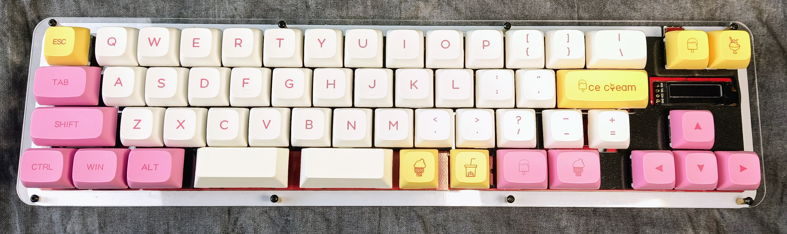

# Fruitbar R2

Fruitbar R2 with IPS Display

0. Remove the back plate to access the boot button on the back of the board.  It is the button closest to the USB. Press and hold the button, plug the board in, then release the button.  You will see a R PI drive.  Drag or copy the nuke Flash UF2 to it from here:
   https://cdn-learn.adafruit.com/assets/assets/000/099/419/original/flash_nuke.uf2 after a few moments the R PI drive will reappear.
1. Install Circuitpython for the Solder Party Stamp board from here: https://circuitpython.org/board/solderparty_rp2040_stamp/ by dragging or copying the UF2 to the drive like the previous step.
2. After about 20 seconds it will reboot again and now a CIRCUITPYTHON drive will show up.  Delete the code.py file
3. Copy the kmk folder to the drive
4. Copy the two .py files in the boards/fruitbar folder to the drive.
5. After a few seconds you should have a keyboard!  To change your options or keymaps just edit or copy new keymap.py file to the board.  That's it!

Extensions enabled by default  
- [Layers](/docs/en/layers.md) Need more keys than switches? Use layers.

Common Extensions

