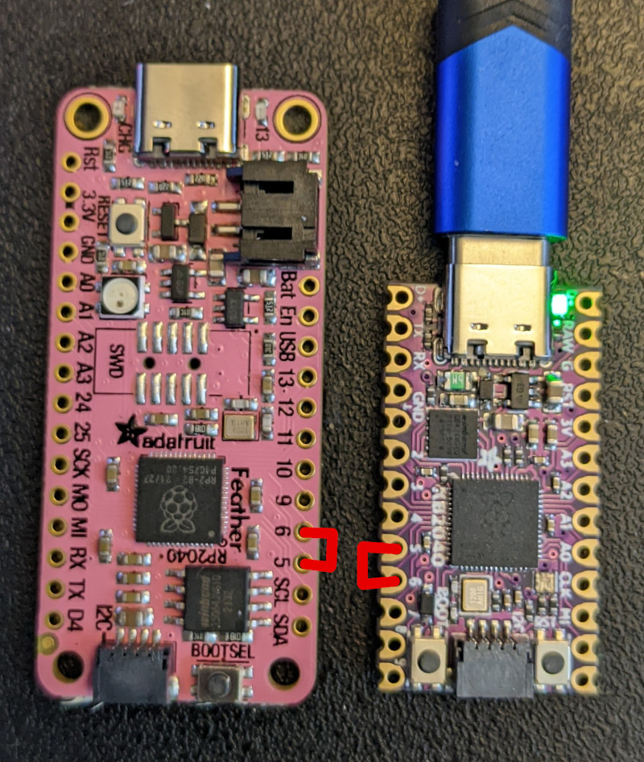

# Getting Started
> Life was like a box of chocolates. You never know what you're gonna get.

KMK is a keyboard focused layer that sits on top of [CircuitPython](https://circuitpython.org/). As such, it should work with most [boards that support CircuitPython](https://circuitpython.org/downloads). It is best to use the last stable version (>7.0).
Known working and recommended devices can be found [here](Officially_Supported_Microcontrollers.md)

<br>

## TL;DR Quick start guide
> To infinity and beyond!
1. [Install CircuitPython on your board](https://learn.adafruit.com/welcome-to-circuitpython/installing-circuitpython). With most boards, it should be as easy as drag and dropping the firmware on the drive
2. Get a [copy of KMK](https://github.com/KMKfw/kmk_firmware/archive/refs/heads/master.zip) from the master branch 
3. Unzip it and copy the KMK folder and the boot.py file at the root of the USB drive corresponding to your board (often appearing as CIRCUITPY)
4. Create a new *code.py* or *main.py* file in the same root directory (same level as boot.py) with the example content hereunder: 

***IMPORTANT:*** adapt the GP0 / GP1 pins to your specific board ! <br>

```
print("Starting")

import board

from kmk.kmk_keyboard import KMKKeyboard
from kmk.keys import KC
from kmk.scanners import DiodeOrientation

keyboard = KMKKeyboard()

keyboard.col_pins = (board.GP0,)
keyboard.row_pins = (board.GP1,)
keyboard.diode_orientation = DiodeOrientation.COL2ROW

keyboard.keymap = [
    [KC.A,]
]

if __name__ == '__main__':
    keyboard.go()
```


5. With a wire / paperclip / whatever, connect the pins you selected for col_pin and row_pin together.



6. If it prints the letter "a" (or a "Q" or ... depending on your keyboard layout), you're done!

<br>


## Now that you're up and running, you may want to go further...
> This is your last chance. After this, there is no turning back. You take the blue pill—the story ends, you wake up in your bed and believe whatever you want to believe. You take the red pill—you stay in Wonderland, and I show you how deep the rabbit hole goes. Remember: all I'm offering is the truth. Nothing more.

### You're extremely lucky and you have a fully supported keyboard
If your keyboard and microcontroller are officially supported, simply visit the page for your files, and dropping them on the root of the "flash drive". Those pages can be found [here](https://github.com/KMKfw/kmk_firmware/tree/master/boards). You will need the `kb.py` and `main.py`. More advanced instructions can be found [here](config_and_keymap.md).

### You've got another, maybe DIY, board and want to customize KMK for it  
First, be sure to understand how your device work, and particularly its specific matrix configuration. You can have a look [here](http://pcbheaven.com/wikipages/How_Key_Matrices_Works/) or read the [guide](https://docs.qmk.fm/#/hand_wire) provided by the QMK team for handwired keyboards
<br>Once you've got the gist of it:
- You can have a look [here](config_and_keymap.md) and [here](keys.md) to start customizing your code.py / main.py file
- There's a [reference](keycodes.md) of the available keycodes
- [International](international.md) extension adds keys for non US layouts and [Media Keys](media_keys.md) adds keys for ... media

And to go even further:
- [Sequences](sequences.md) are used for sending multiple keystrokes in a single action
- [Layers](layers.md) can transform the whole way your keyboard is behaving with a single touch
- [ModTap](modtap.md) allow you to customize the way a key behaves whether it is tapped or hold, and [TapDance](tapdance.md) depending on the number of times it is pressed

Want to have fun features such as RGB, split keyboards and more? Check out what builtin [modules](modules.md) and [extensions](extensions.md) can do!
You can also get ideas from the various [user examples](https://github.com/KMKfw/kmk_firmware/tree/master/user_keymaps) that we provide and dig into our [documentation](README.md).

<br>

## Additional help and support
> Roads? Where we're going we don't need roads.

In case you need it, debugging help can be found [here](debugging.md)

If you need support with KMK or just want to say hi, find us in 
[#kmkfw:klar.sh on Matrix](https://matrix.to/#/#kmkfw:klar.sh).  This channel is 
bridged to Discord [here](https://discordapp.com/widget?id=493256121075761173&theme=dark) 
for convenience. If you ask for help on chat or open a bug report, if possible 
please give us your commit SHA, found by running 
`from kmk.consts import KMK_RELEASE;  print(KMK_RELEASE)` in the REPL on your 
controller.
 


