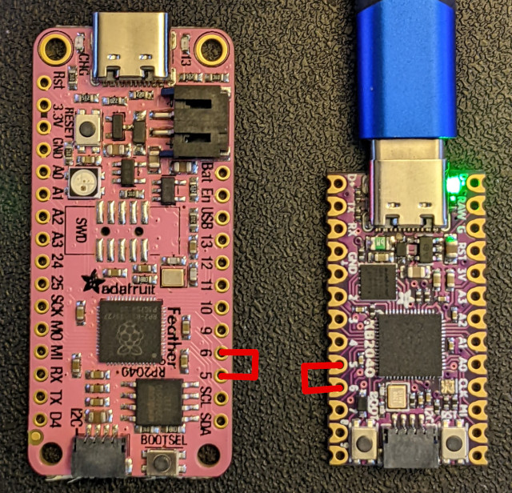

# Getting Started
> Life was like a box of chocolates. You never know what you're gonna get.

KMK is a keyboard focused layer that sits on top of [CircuitPython](https://circuitpython.org/). As such, it should work with most [boards that support CircuitPython](https://circuitpython.org/downloads). KMK requires CircuitPython version 7.3 or above.
Known working and recommended devices can be found in the [list of officially supported microcontrollers](Officially_Supported_Microcontrollers.md)


## TL;DR Quick start guide
> To infinity and beyond!
1. [Install CircuitPython version 7.3 or higher on your board](https://learn.adafruit.com/welcome-to-circuitpython/installing-circuitpython). With most boards, it should be as easy as drag and dropping the firmware on the drive
2. Get an up to date [copy of KMK](https://github.com/KMKfw/kmk_firmware/archive/refs/heads/main.zip) from the main branch 
3. Unzip it and copy the KMK folder and the boot.py file at the root of the USB drive corresponding to your board (often appearing as CIRCUITPY)
4. Create a new *code.py* or *main.py* file in the same root directory (same level as boot.py) with the example content hereunder: 

***IMPORTANT:*** adapt the GP0 / GP1 pins to your specific board !

```
print("Starting")

import board

from kmk.kmk_keyboard import KMKKeyboard
from kmk.keys import KC
from kmk.scanners import DiodeOrientation

keyboard = KMKKeyboard()

keyboard.col_pins = (board.GP0,)
keyboard.row_pins = (board.GP1,)
keyboard.diode_orientation = DiodeOrientation.COL2ROW

keyboard.keymap = [
    [KC.A,]
]

if __name__ == '__main__':
    keyboard.go()
```


5. With a wire / paperclip / whatever, connect the pins you selected for col_pin and row_pin together.



6. If it prints the letter "a" (or a "Q" or ... depending on your keyboard layout), you're done!


## Now that you're up and running, you may want to go further...
> This is your last chance. After this, there is no turning back. You take the blue pill—the story ends, you wake up in your bed and believe whatever you want to believe. You take the red pill—you stay in Wonderland, and I show you how deep the rabbit hole goes. Remember: all I'm offering is the truth. Nothing more.

### You're extremely lucky and you have a fully supported keyboard
If your keyboard and microcontroller are officially supported, simply visit the page for your files, and dropping them on the root of the "flash drive".
Those pages can be found in the repositories [boards folder](https://github.com/KMKfw/kmk_firmware/tree/master/boards).
You will need the `kb.py` and `main.py`. If you need more detailed instructions on how to customize the configuration settings and key mappings, please refer to the [config and keymap](config_and_keymap.md) documentation.

### You've got another, maybe DIY, board and want to customize KMK for it  
First, be sure to understand how your device work, and particularly its specific matrix configuration. You can have a look at [how key matrices work](http://pcbheaven.com/wikipages/How_Key_Matrices_Works/) or read the [guide](https://docs.qmk.fm/#/hand_wire) provided by the QMK team for handwired keyboards
Once you've got the gist of it:
- To start customizing your `code.py`/`main.py` file, please refer to the [config and keymap](config_and_keymap.md) and [keys](keys.md) files respectively, which provide detailed instructions on how to modify the configuration settings and key mappings.
- There's a [reference](keycodes.md) of the available keycodes
- [International](international.md) extension adds keys for non US layouts and [Media Keys](media_keys.md) adds keys for ... media

And to go even further:
- [Macros](macros.md) are used for sending multiple keystrokes in a single action
- [Layers](layers.md) can transform the whole way your keyboard is behaving with a single touch
- [HoldTap](holdtap.md) allow you to customize the way a key behaves whether it is tapped or hold, and [TapDance](tapdance.md) depending on the number of times it is pressed

Want to have fun features such as RGB, split keyboards and more? Check out what builtin [modules](modules.md) and [extensions](extensions.md) can do!
You can also get ideas from the various [user examples](https://github.com/KMKfw/kmk_firmware/tree/master/user_keymaps) that we provide and dig into our [documentation](README.md).


### Pre-compiling KMK for faster boot times or microcontrollers with limited flash

There are two options:
1. To compile KMK yourself you'll need to download and install the [compatible mpy-cross](https://adafruit-circuit-python.s3.amazonaws.com/index.html?prefix=bin/mpy-cross/)
  for your Operating System. Don't forget to add it to your PATH, test by running `mpy-cross` from a shell (Powershell, Bash, Fish, etc). Once that's set up, run either `make compile` (if you have `make`) or `python util/compile.py`to generate the `.mpy` versions of KMK files. Then copy the whole compiled `kmk/` directory to your keyboard.

There are even more compile and copy make targets.
Power user can compile KMK and additional libraries, and then load the bytecode and keyboard code
onto a keyboard in one go:
```sh
make compile copy-compiled copy-board MPY_SOURCES='kmk/ lib/' BOARD='boards/someboard' MOUNTPOINT='/media/user/someboard'
```

2. To download a pre-compiled KMK go to [Actions > Build on the KMK GitHub project page](https://github.com/KMKfw/kmk_firmware/actions/workflows/compile.yml),
  click on the latest build, and you'll find the download link at the bottom of the page under Artifacts. Unzip the download and place the contents in the `kmk/` directory on your keyboard.


On certain microcontrollers that will still not be enough of a size reduction to
fit all of KMK onto the flash (nice!nano for example).
You can remove any optional parts of KMK you aren't using.
Start by skipping `kmk/extensions`, `kmk/modules`, and `kmk/quickpin` and adding in only the files under those paths used in your keyboard (i.e. files that are imported in your `main.py` or `kb.py`).


## Additional help and support
> Roads? Where we're going we don't need roads.

In case you need it, debugging help can be found on the [debugging](debugging.md) page.

For asynchronous support and chatter about KMK, [join our Zulip
community](https://kmkfw.zulipchat.com)!

If you ask for help in chat or open a bug report, if possible
make sure your copy of KMK is up-to-date.
In particular, swing by the Zulip chat *before* opening a GitHub Issue about
configuration, documentation, etc. concerns.
