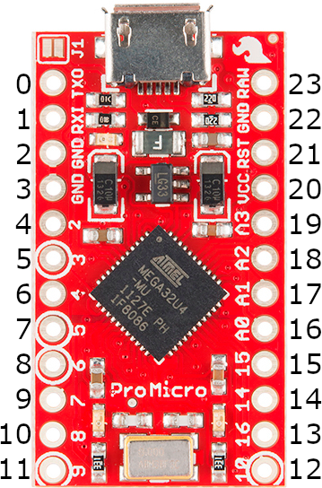

# Quickpin

Quickpin helps devs quickly translate pinouts between boards of similar footprint.
This lets you write a single `kb.py` that can be swapped between
microcontrollers with only a single line change and less mistakes. 

## Supported footprints/boards

- Pro micro footprint
  - Sparkfun Pro micro RP2040 [Sparkfun](https://www.sparkfun.com/products/18288)
  - Boardsource Blok [Boardsource](https://boardsource.xyz/store/628b95b494dfa308a6581622)
  - Nice!nano [Nicekeyboards](https://nicekeyboards.com/nice-nano/)
  - Adafruit KB2040 [Adafruit](https://www.adafruit.com/product/5302)
  - 0xCB Helios [KeebSupply](https://keeb.supply/products/0xcb-helios)

## Pro micro footprint pinout



## Example

In this example, we are converting a Boardsource 3x4 from a hard pinned
nice!nano to a controller agnostic pinout.

```python
row_pins = (board.P1_15, board.P0_02, board.P0_29)
col_pins = (board.P0_09, board.P0_10, board.P1_11, board.P1_13)
```

Converts to the following. Notice that `nice_nano` can be subbed for
`boardsource_blok` or `sparkfun_promicro_rp2040`, or any other board sharing
this pinout.

```python
from kmk.quickpin.pro_micro.nice_nano import pinout as pins

row_pins = (pins[16], pins[17], pins[18])
col_pins = (pins[12], pins[13], pins[14], pins[15])
```

## Porting from AVR pro micro

An additional added convenience for translating from other firmwares with AVR
pro micros has also been added to speed up porting.

```python
from kmk.quickpin.pro_micro.nice_nano import pinout as pins
from kmk.quickpin.pro_Micro.avr_promicro import translate as avr

row_pins = (
    pins[avr['F7']],
    pins[avr['F6']],
    pins[avr['F5']],
)
col_pins = (
    pins[avr['B6']],
    pins[avr['B2']],
    pins[avr['B3']],
    pins[avr['B1']],
)
```


## Adding boards to quickpin support

Quickpin format is simply a list of pins in order of all through hole pins,
going anticlockwise starting at the top left. The orientation should be with the
chips facing toward you, with USB facing the top. If this isn't appliable, or
otherwise is not true, it should be stated in a comment in the file. Any pin
that is not addressable in software should be left as `None` to fill the space,
and align pins correctly for all boards. All boards should be stored in 
`kmk/quickpin/<footprint>/boardname.py`.

Pro Micro RP2040 shown as an example:
```python
import board

pinout = [
    board.TX,
    board.RX,
    None,  # GND
    None,  # GND
    board.D2,
    board.D3,
    board.D4,
    board.D5,
    board.D6,
    board.D7,
    board.D8,
    board.D9,
    board.D21,
    board.MOSI,
    board.MISO,
    board.SCK,
    board.D26,
    board.D27,
    board.D28,
    board.D29,
    None,  # 3.3v
    None,  # RST
    None,  # GND
    None,  # RAW
]

```
